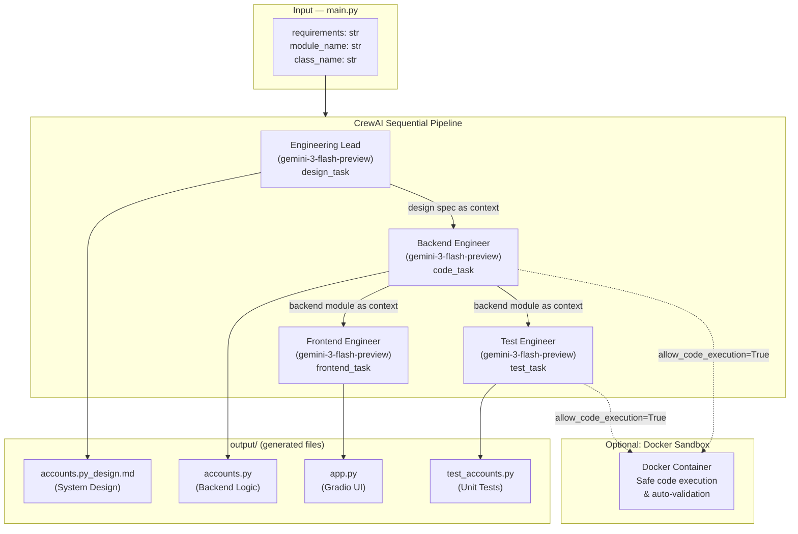

# EngineeringTeam Crew - Trading Platform Builder

Welcome to the EngineeringTeam Crew project, powered by [crewAI](https://crewai.com). This multi-agent AI system uses specialized engineering agents to collaboratively design, develop, and test a complete trading simulation platform with an interactive web interface.


## Project Overview

This project leverages four AI agents working together:
- **Engineering Lead**: Creates detailed system designs from requirements
- **Backend Engineer**: Implements Python backend logic for account management and trading
- **Frontend Engineer**: Builds interactive Gradio-based UI
- **Test Engineer**: Generates comprehensive unit tests

The agents collaborate to produce a fully functional trading platform saved in the `output/` directory.

# Application Preview


*AI-generated trading simulation platform with account management, portfolio tracking, and transaction history*


## Installation

Ensure you have Python >=3.10 <3.13 installed on your system. This project uses [UV](https://docs.astral.sh/uv/) for dependency management.

### Step 1: Install UV

```bash
pip install uv
```

### Step 2: Install Project Dependencies

Navigate to your project directory and install:

```bash
cd engineering_team
crewai install
```

### Step 3: Configure API Keys

**Add your `GEMINI_API_KEY` or `OPENAI_API_KEY` into the `.env` file:**

```ini
GEMINI_API_KEY=your_api_key_here
# or
OPENAI_API_KEY=your_api_key_here
```

## Running the Project

### Generate the Trading Platform

Run the crew to generate the complete application:

```bash
crewai run
```

This will:
1. Create a detailed system design (`output/accounts.py_design.md`)
2. Generate backend code (`output/accounts.py`)
3. Build the frontend UI (`output/app.py`)
4. Create unit tests (`output/test_accounts.py`)

### Run the Generated Application

After the crew completes, navigate to the output folder and run the app:

```bash
cd output
uv add gradio
uv run app.py
```

The trading platform will launch in your browser at `http://localhost:7860`

## Important: Docker & Code Execution

### About Safe Code Execution

CrewAI supports **safe code execution** mode, which uses Docker containers to isolate and securely execute generated code. This prevents potentially harmful code from affecting your system.

**Current Configuration:** Code execution is **disabled** in this project (lines commented out in `src/engineering_team/crew.py`).

### Enabling Code Execution (Optional)

If you have Docker installed and want agents to test code automatically:

1. **Install Docker Desktop** from [docker.com](https://www.docker.com/products/docker-desktop/)

2. **Uncomment code execution lines** in `src/engineering_team/crew.py`:

```python
@agent
def backend_engineer(self) -> Agent:
    return Agent(
        config=self.agents_config['backend_engineer'],
        verbose=True,
        allow_code_execution=True,      # Uncomment
        code_execution_mode="safe",     # Uncomment (uses Docker)
        max_code_execution_time=240,    # Uncomment
        max_retries=5,                  # Uncomment
    )

@agent
def test_engineer(self) -> Agent:
    return Agent(
        config=self.agents_config['test_engineer'],
        verbose=True,
        allow_code_execution=True,      # Uncomment
        code_execution_mode="safe",     # Uncomment (uses Docker)
        max_code_execution_time=240,    # Uncomment
        max_retries=5,                  # Uncomment
    )
```

3. **Run the crew again:**

```bash
crewai run
```

With Docker enabled, agents can validate their code automatically during generation.

## Project Structure

```
engineering_team/
├── src/engineering_team/
│   ├── crew.py              # Agent definitions
│   ├── main.py              # Entry point with requirements
│   └── config/
│       ├── agents.yaml      # Agent configurations
│       └── tasks.yaml       # Task definitions
├── output/                  # Generated application files
│   ├── accounts.py          # Backend trading logic
│   ├── app.py              # Gradio web interface
│   ├── test_accounts.py    # Unit tests
│   └── accounts.py_design.md # System design document
└── .env                    # API keys (create this)
```

## Customizing the Platform

### Modify Requirements

Edit `src/engineering_team/main.py` to change the trading platform requirements:

```python
requirements = """
Your custom requirements here...
"""
```

### Configure Agents

- **Agents**: Modify `src/engineering_team/config/agents.yaml`
- **Tasks**: Modify `src/engineering_team/config/tasks.yaml`
- **Logic**: Modify `src/engineering_team/crew.py`

## Features of Generated Trading Platform

- ✅ User account creation and onboarding
- ✅ Deposit and withdraw funds with validation
- ✅ Buy/sell shares with real-time price lookup
- ✅ Portfolio value calculation with P&L tracking
- ✅ Transaction history with filtering
- ✅ Interactive Gradio web interface
- ✅ Comprehensive error handling and validation

## Troubleshooting

### API Rate Limits / Model Overloaded

If you see `503 Service Unavailable` errors:
- Wait 5-10 minutes and retry
- The LLM provider (Gemini/OpenAI) may be temporarily overloaded
- The crew has automatic retry logic built-in

### Docker Not Found Error

If you see `Docker is not installed` error:
- Ensure code execution lines are **commented out** in `crew.py`
- Or install Docker Desktop and uncomment those lines

### Missing Gradio Module

If `uv run app.py` fails:
```bash
cd output
uv add gradio
uv run app.py
```

## Support

For support, questions, or feedback:
- Visit [crewAI documentation](https://docs.crewai.com)
- [GitHub repository](https://github.com/joaomdmoura/crewai)
- [Join Discord](https://discord.com/invite/X4JWnZnxPb)
- [Chat with docs](https://chatg.pt/DWjSBZn)

# EngineeringTeam Crew - Trading Platform Builder

> A four-agent CrewAI system that takes plain-English requirements and autonomously generates a production-ready trading simulation platform — complete with backend logic, a Gradio UI, unit tests, and a system design document — all in a single `crewai run`.

---

## Table of Contents

1. [Key Features](#key-features)
2. [Architecture](#architecture)
3. [Quick Start](#quick-start)
4. [Project Structure](#project-structure)
5. [Results & Benchmarks](#results--benchmarks)
6. [Technical Decisions](#technical-decisions)
7. [Future Roadmap](#future-roadmap)

---

## Key Features

- **4-Agent Sequential Pipeline** — Engineering Lead → Backend Engineer → Frontend Engineer → Test Engineer; each agent's output feeds directly into the next as context.
- **Design-First Workflow** — The Engineering Lead produces a full Markdown design spec (`accounts.py_design.md`) before any code is written, enforcing a structured SDLC.
- **Self-Contained Backend** — AI-generated `accounts.py` handles account onboarding, deposit/withdraw, buy/sell shares with average-price tracking, P&L calculation, and transaction history.
- **Gradio UI Auto-Generation** — Frontend Engineer builds a working multi-tab Gradio app (`app.py`) directly from the backend module, runnable immediately after crew completion.
- **AI-Written Unit Tests** — Test Engineer produces `test_accounts.py` with coverage for all edge cases (negative balance, invalid symbols, oversell).
- **Optional Docker Sandboxing** — Backend and test agents can be configured to execute and validate their own code inside isolated Docker containers.
- **LLM-Agnostic** — Agents use Gemini 3 Flash by default; swap to any OpenAI-compatible model via a single `.env` change.
- **Fully Configurable via YAML** — Agent roles, goals, backstories, and task pipelines all live in `config/agents.yaml` and `config/tasks.yaml`.

---

## Architecture



---

## Application Preview

# Application Preview


*AI-generated trading simulation platform with account management, portfolio tracking, and transaction history*

---

## Quick Start

### Prerequisites

| Requirement | Notes |
|---|---|
| Python | `>=3.10, <3.13` |
| [UV](https://docs.astral.sh/uv/) | Fast Python package manager |
| Gemini or OpenAI API key | Gemini 3 Flash used by default |
| Docker Desktop *(optional)* | For safe agent code execution |

### 1. Install UV

```bash
pip install uv
```

### 2. Install project dependencies

```bash
cd engineering_team
crewai install
```

### 3. Configure API keys

Create or edit the `.env` file:

```env
GEMINI_API_KEY=your_gemini_api_key_here
# or
OPENAI_API_KEY=your_openai_api_key_here
```

### 4. Run the crew

```bash
crewai run
```

The crew will execute four tasks in sequence and write all outputs to the `output/` directory:

| Step | Agent | Output file |
|---|---|---|
| 1 | Engineering Lead | `output/accounts.py_design.md` |
| 2 | Backend Engineer | `output/accounts.py` |
| 3 | Frontend Engineer | `output/app.py` |
| 4 | Test Engineer | `output/test_accounts.py` |

### 5. Launch the generated trading app

```bash
cd output
uv add gradio
uv run app.py
```

Open `http://localhost:7860` in your browser.

---

## Project Structure

```
engineering_team/
├── src/engineering_team/
│   ├── crew.py              # Agent & task definitions (CrewBase)
│   ├── main.py              # Entry point — define requirements here
│   └── config/
│       ├── agents.yaml      # Agent roles, goals, backstories, LLM
│       └── tasks.yaml       # Task descriptions, expected outputs, output files
├── output/                  # All AI-generated files land here
│   ├── accounts.py          # Generated backend (Account class)
│   ├── app.py               # Generated Gradio UI
│   ├── test_accounts.py     # Generated unit tests
│   └── accounts.py_design.md # Generated system design document
├── knowledge/
│   └── user_preference.txt  # Optional crew knowledge source
├── pyproject.toml           # UV/Hatchling project config
└── .env                     # API keys (not committed)
```

---

## Results & Benchmarks

| Metric | Value |
|---|---|
| Agents | 4 (Lead, Backend, Frontend, Test) |
| LLM | Gemini 3 Flash Preview |
| Execution process | Sequential (deterministic ordering) |
| Tasks per run | 4 tasks, each with file output |
| Avg. end-to-end run time | ~3–6 minutes (depending on Gemini API latency) |
| Generated backend | ~150–200 lines — full `Account` class with 7 methods |
| Generated UI | Multi-tab Gradio app with onboarding, trade panel, portfolio view, transaction history |
| Generated tests | Edge-case coverage: invalid inputs, insufficient funds, unknown symbols, oversell |
| Supported stock symbols | COALINDIA (₹450), MARICO (₹670), ICICIAMC (₹1200) via `get_share_price()` |
| Code execution mode | Disabled by default; Docker sandbox available |

> Run time is network-bound. With Docker code execution enabled, agents self-validate output and may retry up to 5 times before finalising.

---

## Technical Decisions

### CrewAI over LangGraph / AutoGen
- **Declarative YAML config** — agent roles and task flows are defined in `agents.yaml` / `tasks.yaml` without writing graph wiring code, making the pipeline easy to read and modify.
- **Built-in context chaining** — CrewAI's `context:` field in `tasks.yaml` automatically passes the output of `design_task` into `code_task`, mimicking a real code-review handoff with zero boilerplate.
- **`crewai run` CLI** — single command execution with built-in retry logic and verbose tracing.

### Sequential process over Hierarchical
- The SDLC has a strict dependency order: you cannot write code before the design, and you cannot write tests before the code. A sequential process enforces this without a manager LLM adding cost and latency.

### Gemini 3 Flash over GPT-4o
- **Cost** — Flash tier is significantly cheaper at the output token volumes generated (150–200 lines of Python per task).
- **Speed** — Lower time-to-first-token reduces total crew runtime.
- **Swappable** — Changing `llm:` in `agents.yaml` to `openai/gpt-4o` is a one-line swap; no code changes needed.

### YAML-defined agents over hardcoded Python
- Separating configuration from logic means changing an agent's LLM, role, or goal requires editing a YAML file rather than touching `crew.py`, reducing the risk of introducing bugs when iterating on prompts.

### Optional Docker sandboxing (disabled by default)
- Enabling `allow_code_execution=True` with `code_execution_mode="safe"` lets Backend and Test agents run their generated code inside an isolated Docker container and self-correct on errors. It is opt-in because it requires Docker Desktop and increases run time.

### Design-first task ordering
- Requiring the Engineering Lead to output a Markdown spec first grounds all downstream agents. The backend agent receives the exact function signatures it must implement, reducing hallucinated APIs and improving inter-agent consistency.

---

## Customising the Platform

### Change the requirements

Edit `src/engineering_team/main.py`:

```python
requirements = """
Your custom requirements here...
"""
module_name = "my_module.py"
class_name = "MyClass"
```

### Enable Docker code execution

Uncomment the relevant lines in `src/engineering_team/crew.py` for `backend_engineer` and `test_engineer`:

```python
allow_code_execution=True,
code_execution_mode="safe",   # uses Docker
max_code_execution_time=240,
max_retries=5,
```

---

## Troubleshooting

| Problem | Solution |
|---|---|
| `503 Service Unavailable` | Gemini/OpenAI rate limit — wait 5–10 minutes and retry |
| `Docker is not installed` | Comment out `allow_code_execution` lines in `crew.py`, or install Docker Desktop |
| `ModuleNotFoundError: gradio` | Run `uv add gradio` inside the `output/` directory before `uv run app.py` |

---

## Future Roadmap

- [ ] **Live market data integration** — Replace the `get_share_price()` mock with a real NSE/BSE API (e.g., `yfinance` or Alpha Vantage).
- [ ] **Parallel agent execution** — Run Frontend and Test engineers concurrently after the Backend task, cutting total run time roughly in half.
- [ ] **Multi-module generation** — Support requirements that span several Python modules (e.g., separate `auth.py`, `portfolio.py`, `orders.py`).
- [ ] **Persistent crew memory** — Use CrewAI's long-term memory store so agents learn from previous runs and avoid repeating the same design mistakes.
- [ ] **Automated test runner** — Add a post-crew hook that runs `pytest output/test_accounts.py` and feeds failures back to the Test Engineer for self-correction.
- [ ] **Streaming output UI** — Build a Gradio or Streamlit dashboard that shows agent logs and generated code in real-time as the crew runs.
- [ ] **Generalised project generator** — Parameterise the crew fully so any `requirements.txt`-style spec sheet generates a complete Python project, not just a trading platform.
- [ ] **CI/CD integration** — GitHub Actions workflow that runs the crew on push, commits generated files, and opens a PR for human review.

---

## License

This project uses the [crewAI](https://crewai.com) framework. Refer to their repository for licensing details. Always review AI-generated code in the `output/` directory before deploying to production.
2. ✅ Generate backend code (`output/accounts.py`)
3. ✅ Build the frontend UI (`output/app.py`)
4. ✅ Create unit tests (`output/test_accounts.py`)

### Run the Generated Application

After the crew completes, navigate to the output folder and run the app:

```bash
cd output
uv add gradio
uv run app.py
```

The trading platform will launch in your browser at `http://localhost:7860`

## Important: Docker & Code Execution

### About Safe Code Execution

CrewAI supports **safe code execution** mode, which uses Docker containers to isolate and securely execute generated code. This prevents potentially harmful code from affecting your system.

**Current Configuration:** Code execution is **disabled** in this project (lines commented out in `src/engineering_team/crew.py`).

### Enabling Code Execution (Optional)

If you have Docker installed and want agents to test code automatically:

1. **Install Docker Desktop** from [docker.com](https://www.docker.com/products/docker-desktop/)

2. **Uncomment code execution lines** in `src/engineering_team/crew.py`:

```python
@agent
def backend_engineer(self) -> Agent:
    return Agent(
        config=self.agents_config['backend_engineer'],
        verbose=True,
        allow_code_execution=True,      # Uncomment
        code_execution_mode="safe",     # Uncomment (uses Docker)
        max_code_execution_time=240,    # Uncomment
        max_retries=5,                  # Uncomment
    )

@agent
def test_engineer(self) -> Agent:
    return Agent(
        config=self.agents_config['test_engineer'],
        verbose=True,
        allow_code_execution=True,      # Uncomment
        code_execution_mode="safe",     # Uncomment (uses Docker)
        max_code_execution_time=240,    # Uncomment
        max_retries=5,                  # Uncomment
    )
```

3. **Run the crew again:**

```bash
crewai run
```

With Docker enabled, agents can validate their code automatically during generation.

## Project Structure

```
engineering_team/
├── src/engineering_team/
│   ├── crew.py              # Agent definitions
│   ├── main.py              # Entry point with requirements
│   └── config/
│       ├── agents.yaml      # Agent configurations
│       └── tasks.yaml       # Task definitions
├── output/                  # Generated application files
│   ├── accounts.py          # Backend trading logic
│   ├── app.py              # Gradio web interface
│   ├── test_accounts.py    # Unit tests
│   └── accounts.py_design.md # System design document
└── .env                    # API keys (create this)
```

## Customizing the Platform

### Modify Requirements

Edit `src/engineering_team/main.py` to change the trading platform requirements:

```python
requirements = """
Your custom requirements here...
"""
```

### Configure Agents

- **Agents**: Modify `src/engineering_team/config/agents.yaml`
- **Tasks**: Modify `src/engineering_team/config/tasks.yaml`
- **Logic**: Modify `src/engineering_team/crew.py`

## Features of Generated Trading Platform

- ✅ User account creation and onboarding
- ✅ Deposit and withdraw funds with validation
- ✅ Buy/sell shares with real-time price lookup
- ✅ Portfolio value calculation with P&L tracking
- ✅ Transaction history with filtering
- ✅ Interactive Gradio web interface
- ✅ Comprehensive error handling and validation

## Troubleshooting

### API Rate Limits / Model Overloaded

If you see `503 Service Unavailable` errors:
- Wait 5-10 minutes and retry
- The LLM provider (Gemini/OpenAI) may be temporarily overloaded
- The crew has automatic retry logic built-in

### Docker Not Found Error

If you see `Docker is not installed` error:
- Ensure code execution lines are **commented out** in `crew.py`
- Or install Docker Desktop and uncomment those lines

### Missing Gradio Module

If `uv run app.py` fails:
```bash
cd output
uv add gradio
uv run app.py
```

## Support

For support, questions, or feedback:
- Visit [crewAI documentation](https://docs.crewai.com)
- [GitHub repository](https://github.com/joaomdmoura/crewai)
- [Join Discord](https://discord.com/invite/X4JWnZnxPb)
- [Chat with docs](https://chatg.pt/DWjSBZn)

## License

This project uses crewAI framework. Check their repository for licensing details.

---

**Note:** Always review generated code in the `output/` directory before running it in production environments. The agents generate functional code, but manual review ensures it meets your specific security and business requirements.

